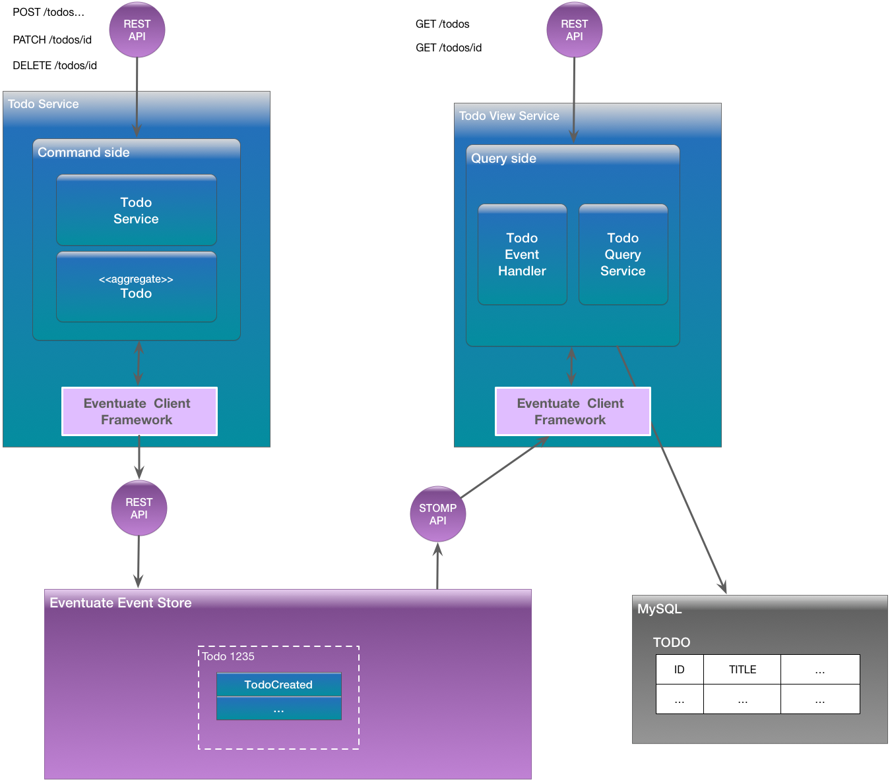

# Todo List example application

This project refers to illustrate how an app, following the [CQRS](http://microservices.io/patterns/data/cqrs.html) pattern, can be distributed in the Cloud (GCP) using Kubernetes and Spinnaker for Continuous Deployment.

Note: The application originates from the [eventuate-examples-java-spring-todo-list](https://github.com/eventuate-examples/eventuate-examples-java-spring-todo-list) project.

# Architecture

The Todo application has a microservice architecture.
It is written using the [Eventuate Client Framework for Java](http://eventuate.io/docs/java/eventuate-client-framework-for-java.html), which provides an [event sourcing based programming model](http://eventuate.io/whyeventsourcing.html).
The following diagram shows the Todo List application architecture:



The application consists of the following:

* Todo service - a Java and Spring Boot-based service that has a HATEOAS-style REST API for creating, updating and querying todo list items.
It uses Eventuate to persist aggregates using event sourcing.
* Todo view service - a Java and Spring Boot-based service that provides a REST API for querying todos.
It implements a [Command Query Responsibility Segregation (CQRS)](http://microservices.io/patterns/data/cqrs.html) view of todos using MySQL.
MySQL is kept up to date by subscribing to events produced by the Todo service.
* MySQL database - stores the CQRS view of todo list items.

# Building and running the application

The steps for building both versions of the application are identical.
However, the details of how to build and run the services depend slightly on whether you are using Eventuate SaaS or Eventuate Local.

## Building and running using Eventuate SaaS

First, must [sign up to get your credentials](https://signup.eventuate.io/) in order to get free access to the SaaS version.

Next, build the application

```
./gradlew assemble
```

Next, you can launch the services using [Docker Compose](https://docs.docker.com/compose/):

```
docker-compose build
docker-compose up -d
```

## Building and running using Eventuate Local

First, build the application

```
./gradlew assemble -P eventuateDriver=local
```

Next, launch the services using [Docker Compose](https://docs.docker.com/compose/):

```
export DOCKER_HOST_IP=...
docker-compose -f docker-compose-eventuate-local.yml build
docker-compose -f docker-compose-eventuate-local.yml up -d
```

Note: You need to set `DOCKER_HOST_IP` before running Docker Compose.
This must be an IP address or resolvable hostname.
It cannot be `localhost`.
See this [guide to setting `DOCKER_HOST_IP`](http://eventuate.io/docs/usingdocker.html) for more information.

# Using the application

Once the application has started, you can use the application via the Swagger UI.

* `http://${DOCKER_HOST_IP}:8080/swagger-ui.html` - the monolithic application

# Using the Eventuate Local console

You can also use the Eventuate Local console to view aggregates and watch the stream of events.
Visit the URL `http://${DOCKER_HOST_IP}:8085`